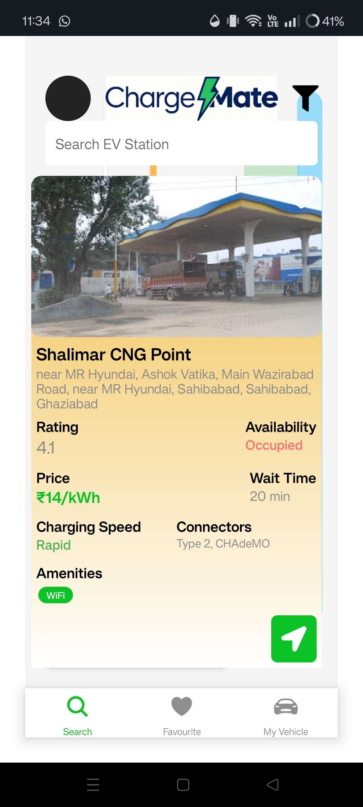

# ⚡ EV Charging Station Locator App

<p align="center">
  
</p>

Welcome to the **EV Charging Station Locator App** 🚗🔋  
Find nearby EV charging stations, search specific ones, and get real-time navigation seamlessly.

---

## 🛠️ Tech Stack

<p align="left">
  
  
  
  
  
</p>

---

## 🚀 Features

- 🔍 **Station Locator:** Find nearby EV charging stations using the **Google Place API**.  
- 👤 **User Authentication:** Secure **sign-in/sign-up** powered by **Clerk**.  
- 🗺️ **Search Functionality:** Quickly locate stations with **Google Place Autocomplete**.  
- 📍 **Location Marker:** View your current location on an interactive map.  
- 🧭 **Navigate to Station:** Get directions instantly via **Google Maps**.  

---

## 📱 How It Works

1. **Login / Sign Up** → Authenticate securely with Clerk.  
2. **Locate Stations** → Nearby EV charging stations automatically appear.  
3. **Search** → Use the search bar to find a specific station.  
4. **Navigate** → Tap a station to open Google Maps for directions.  

---

## ⚙️ Setup Instructions

1. **Clone the repository**  

   ```bash
   git clone https://github.com/Ari-111/EV-Charging-app.git
