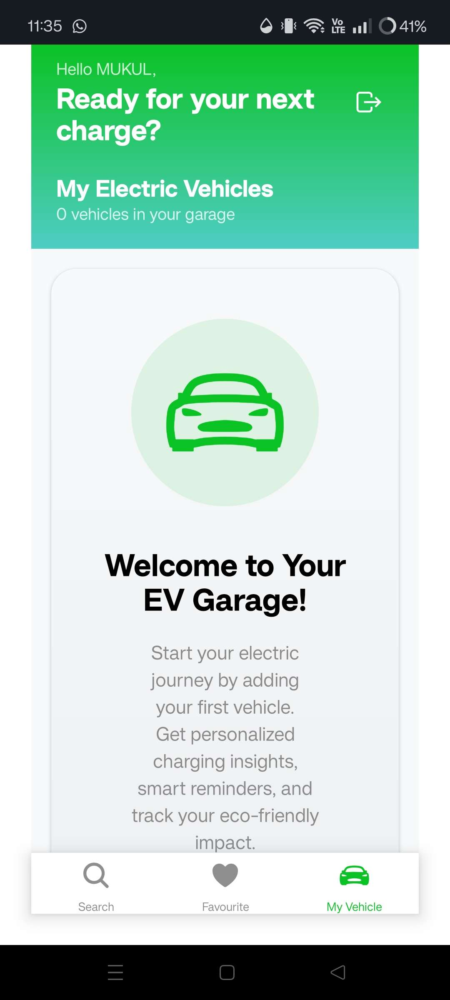
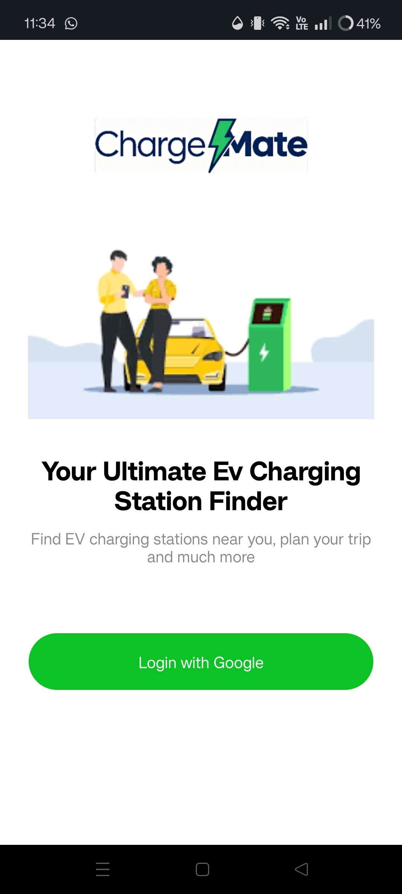

# ⚡ EV Charging Station Locator App

<p align="center">
  
  
  
</p>

🚗🔋 **EV Charging Station Locator App** helps users easily discover nearby EV charging stations, check availability, and navigate seamlessly.  
Built for a **sustainable future**, this app enables EV owners to find charging points in real time and plan their journeys efficiently.  

---

## 🌍 Problem Statement

With the rise of **electric vehicles**, the lack of real-time information about charging stations (availability, connectors, speed, and cost) creates **range anxiety** for EV owners.  

---

## 💡 Our Solution

The **EV Charging Station Locator App** solves this problem by:  
- Providing **live nearby station discovery**  
- Showing **availability, wait time, and charging cost**  
- Offering **navigation support via Google Maps**  
- Allowing users to **search and filter** charging stations  

---

## 🚀 Features

- 🔍 **Station Locator:** Find EV charging stations using **Google Place API**  
- 👤 **Authentication:** Secure sign-in/sign-up powered by **Clerk**  
- 🗺️ **Search Functionality:** Search with Google Place Autocomplete  
- 📍 **Location Marker:** Track your current location in real-time  
- ⚡ **Station Details:** Availability, wait time, pricing, amenities & connectors  
- 🧭 **Navigation:** Direct route guidance with Google Maps  

---

## 🛠️ Tech Stack

<p align="left">
  
  
  
  
  
</p>

---

## 📱 App Flow

1. **Login / Sign Up** → Authenticate with Clerk  
2. **Locate Stations** → Auto-detect nearby charging stations  
3. **Check Details** → Availability, cost, speed, connectors & wait time  
4. **Navigate** → Open Google Maps for directions  

---

## ⚙️ Setup Instructions

1. **Clone the repository**  

   ```bash
   git clone https://github.com/Ari-111/EV-Charging-app.git
